  <picture>
    <source media="(prefers-color-scheme: dark)" srcset="./workspace/dark.svg">
    <source media="(prefers-color-scheme: light)" srcset="./workspace/light.svg">
    
  </picture>

 

# 💫 About Me

🔭 I’m currently working on **Enterprise-Scale RAG & Agentic AI Platform** - LLM-driven systems for querying large, multi-domain technical and functional documentation with strong emphasis on accuracy, security, and scalability.

🌱 I’m currently learning **Agent orchestration, advanced RAG patterns, AI system design, and performance optimization**.

👯 I’m looking to collaborate on **Production-grade AI systems, Enterprise RAG, autonomous agents, internal AI platforms, and large-scale knowledge systems.**

🤝 I’m looking for help with **Hard problems in AI at scale** (LLM evaluation, latency optimization, vector database design, and MLOps for enterprise environments).

💬 Ask me about **LLMs, Retrieval-Augmented Generation (RAG), Agentic AI, AI system architecture, LLM evaluation, prompt engineering, vector databases, enterprise AI design**.

📫 How to reach me: [faizal03hussain@gmail.com](mailto:faizal03hussain@gmail.com)

---

## 🌐 Socials

  
  
  

## 💻 Tech Stack

  
  
  
  
  
  
  
  
  
  
  
  
  
  
  
  
  
  
  
  
  
  
  
  
  
  
  
  
  
  
  
  
  
  
  
  

## 📊 GitHub Stats

  
  

  

## 🏆 GitHub Trophies

  

### ✍️ Random Dev Quote

  

### 🔝 Top Contributed Repo

  

---

  

